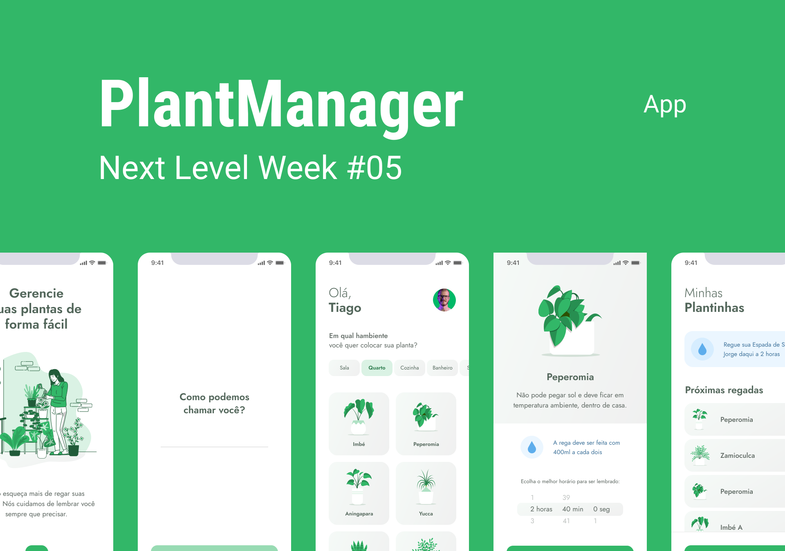

<h1 align="center" >
    
</h1>

<p align="center">
  ## 💻 Project

  [PlantManager] para apaixonados por plantas e tecnologia, gerencie suas plantas de forma fácil e prática! 🌱💚   

  Este é um projeto desenvolvido durante a **[Next Level Week](https://nextlevelweek.com/)** trilha [React Native](https://reactnative.dev/), apresentado por **[Rodrigo Gonçalves Santana](https://www.linkedin.com/in/rodrigo-gon%C3%A7alves-santana/) / [@Rocketseat](https://rocketseat.com.br/)** 19 a 25 de abril de 2021.

  ## 🔖 Layout

  Layout desenvolvido por [Tiago Luchtenberg](@tiagoluchtenberg) / [Layout Mobile](https://www.figma.com/file/1HTAd8tToSodQQfkqb22qW/PlantManager-NLW5-ReactNative?node-id=0%3A1) 
</p>

<p align="center">
  

</p>

<p align="center">
  
</p>

## 🧪 Technologies

Este projeto foi desenvolvido utilizando as seguintes tecnologias:

- [Expo](https://expo.io/) ramework React Native.
- [Async Storage](https://react-native-async-storage.github.io/async-storage/docs/install/), para salvar as plantas no armazenamento local.
- [Expo Notifications](https://docs.expo.io/versions/latest/sdk/notifications/), envia notificação local para o usuário
- [styled-components](https://styled-components.com/) para estilos.
- [Lottie](https://github.com/lottie-react-native/lottie-react-native), para carregar a animação.
- [axios](https://github.com/axios/axios), Axios é um cliente HTTP baseado em Promises para fazer requisições. 
- [date-fns](https://date-fns.org), datas e horários no JavaScript com date-fns

## 🚀 Executando API 

Clone o projeto e acesse a pasta

```
$ git clone https://github.com/AndreBento/plantmanager-nlw5-rn.git && cd plantmanager-nlw5-rn
```
Primeiro, altere a `baseURL` propriedade em `./src/services/api.ts`, para o seu IP, com `3333` porta.

Siga os passos abaixo
```bash
# Install the dependencies
$ yarn

# Depois, abra uma nova janela de terminal e execute
$ json-server ./src/services/server.json --host "Seu IP" --port 3333

# Run the JSON server
$ expo server

# Start the project
$ yarn dev
```

## 🚀 Para executar este aplicativo em um emulador / simulator

[IOS]

Na interface do servidor Expo, clique em `Run on iOS simulator`

[Android]

Na interface do servidor Expo, clique em `Run on Android device/emulator`

## Para executar este aplicativo em um dispositivo físico

Primeiro, baixe Expo go em seu dispositivo.
  - [Android](https://play.google.com/store/apps/details?id=host.exp.exponent&hl=pt_BR&gl=US)
  - [IOS](https://apps.apple.com/br/app/expo-go/id982107779)

Depois, verifique o QrCode na interface do servidor Expo

## 📝 License

Este projeto está licenciado sob a Licença MIT. Consulte o arquivo de [LICENSE](LICENSE.md) para obter detalhes.


---

<p align="center">Feito por Carlos André Bento 🚀 </p>
